# Registo do Laboratório de Cibersegurança

Este documento serve para registar, ao longo dos meses, os exercícios práticos realizados no laboratório de cibersegurança montado em VMware Workstation.

Cada entrada documenta: **objetivo/propósito**, **tipo de ataque ou técnica**, **comandos utilizados**, **resultado**, **como nos podemos defender**, e — quando aplicável — **o que correu mal ou falhou** no final da etapa.

## Topologia do laboratório

- **Router/Firewall:** OPNsense (gateway `192.168.10.254`)
- **Rede interna do lab:** LAN Segment "rede cyber" (`192.168.10.0/24`), isolada da rede de casa
- **Saída para a internet:** NAT configurado no OPNsense (WAN)
- **Máquinas do lab:**
  - Servidor Vulnerável (`192.168.10.101`)
  - Kali Atacante (`192.168.10.102`)
  - Windows Server
  - Windows 11
  - Ubuntu Desktop

## Enquadramento nas certificações e normas em estudo

Cada entrada do registo passa a indicar, quando fizer sentido, a que domínio(s) das certificações/normas em estudo o exercício toca — para perceber que "setor" de conhecimento está a ser exercitado. Referência rápida dos domínios disponíveis:

**Security+ (SY0-701):** D1 Conceitos Gerais de Segurança · D2 Ameaças, Vulnerabilidades e Mitigações · D3 Arquitetura de Segurança · D4 Operações de Segurança · D5 Gestão de Programa de Segurança

**CEH:** D1 Fundamentos, Metodologia e Engenharia Social · D2 Reconhecimento, Scanning e Enumeração · D3 System Hacking e Malware · D4 Sniffing, Rede e Perímetro · D5 Web Server e Web Application Hacking · D6 Redes Sem Fios · D7 Mobile, IoT e OT · D8 Cloud Computing · D9 Criptografia

**ISO/IEC 27001:** D1 Estrutura da Norma · D2 Liderança e Planeamento · D3 Gestão de Risco e Declaração de Aplicabilidade · D4 Suporte e Operação · D5 Desempenho e Melhoria · D6 Controlos do Anexo A · D7 Auditoria e Certificação

**NIS2:** D1 Âmbito e Qualificação de Entidades · D2 Governação e Responsabilidade da Gestão · D3 Medidas de Gestão de Risco (Art. 21.º) · D4 Notificação de Incidentes (Art. 23.º) · D5 Supervisão, Execução e Sanções · D6 Cooperação Europeia · D7 Regime Jurídico Português

**CompTIA A+ Core 1:** D1 Dispositivos Móveis · D2 Redes · D3 Hardware · D4 Virtualização e Computação em Nuvem · D5 Diagnóstico de Hardware e Redes

**CompTIA A+ Core 2:** D1 Sistemas Operativos · D2 Segurança · D3 Resolução de Problemas de Software · D4 Procedimentos Operacionais

Nem todos os materiais são de cibersegurança pura (os A+ são mais de suporte técnico geral) — a integração só é feita quando o exercício toca genuinamente no domínio; não se força correspondência onde não existe.

---

## Entrada #1 — Scan nmap inicial ao Servidor Vulnerável

**Data/hora:** 2026-08-02, 16:27
**Máquinas ligadas:** OPNsense, Kali Atacante (`192.168.10.102`), Servidor Vulnerável (`192.168.10.101`)

### Objetivo / Propósito

Fazer o levantamento inicial (reconhecimento) do Servidor Vulnerável: descobrir que portas estão abertas, que serviços correm e que versões, para se ter uma baseline do estado do alvo antes de qualquer exercício de exploração.

### Tipo de ataque / técnica

**Reconhecimento (Reconnaissance)** — a primeira fase de qualquer teste de intrusão (cf. Cyber Kill Chain / MITRE ATT&CK: Reconnaissance). Aqui especificamente: **port scanning** e **service/version detection** com nmap.

### Comando executado

```bash
sudo nmap -sV -sC -p- 192.168.10.101
```

### Resultado

```
Nmap scan report for 192.168.10.101
Host is up (0.00059s latency).
Not shown: 65534 closed tcp ports (reset)
PORT   STATE SERVICE VERSION
22/tcp open   ssh     OpenSSH 9.6p1 Ubuntu 3ubuntu13.18 (Ubuntu Linux; protocol 2.0)
| ssh-hostkey:
|   256 1e:a2:4c:c6:6d:d1:26:49:c9:b7:9a:fb:c3:dd:2c:6a (ECDSA)
|_  256 80:75:fc:43:b4:35:de:f9:60:ce:bc:a8:08:5c:2c:0d (ED25519)
MAC Address: 00:0C:29:B4:8B:9C (VMware)
Service Info: OS: Linux; CPE: cpe:/o:linux:linux_kernel

Nmap done: 1 IP address (1 host up) scanned in 2.67 seconds
```

### Observações e interpretação

- Apenas **1 porta aberta em 65535**: SSH (22/tcp), com **OpenSSH 9.6p1** — versão recente, sem vulnerabilidades públicas graves conhecidas associadas.
- Todas as restantes portas estão fechadas com reset ativo (o host responde mas recusa a ligação).
- Sistema identificado como Linux, sem outros serviços a expor mais detalhe sobre a distribuição/kernel exato.
- Scan rápido (2.67s) e sem latência (0.00059s), como esperado entre VMs na mesma máquina física.

### Como nos podemos defender

- Manter o SSH atualizado (já está numa versão recente, o que é uma boa prática de base).
- Desativar login por password e usar apenas chaves públicas, para reduzir a superfície de brute-force.
- Restringir o acesso SSH por firewall (ex. regra no OPNsense que só permita a origem do Kali/administração, não toda a LAN).
- Usar `fail2ban` para bloquear tentativas repetidas de login falhado.

### Domínios relacionados

- **CEH — D2 (Reconhecimento, Scanning e Enumeração):** correspondência direta — este é exatamente o tipo de exercício desse domínio.
- **Security+ — D2 (Ameaças, Vulnerabilidades e Mitigações):** o port scanning é uma técnica de deteção que se enquadra neste domínio.
- **A+ Core 1 — D2 (Redes):** leitura de portas, serviços e protocolos de rede.

### O que correu mal / faltou

Nada falhou tecnicamente — mas o resultado ficou aquém do esperado: para um "Servidor Vulnerável" de treino, ter apenas SSH exposto é invulgar. Isto levou a investigar (Entrada #2) e a perceber que a VM ainda não tinha nenhum software vulnerável instalado.

### Próximos passos

- [x] Confirmar se há serviços vulneráveis instalados mas inativos no Servidor Vulnerável → ver Entrada #2
- [ ] Repetir o scan após ativar/instalar esses serviços
- [ ] Explorar credenciais e superfícies de ataque no serviço SSH exposto (ex. brute-force controlado, se aplicável ao exercício)

---

## Entrada #2 — Verificação de serviços no Servidor Vulnerável

**Data/hora:** 2026-08-02, 16:29
**Objetivo:** confirmar se existem serviços vulneráveis instalados mas inativos, explicando o resultado "pobre" do scan da Entrada #1.

### Tipo de ataque / técnica

Não é um ataque — é uma etapa de **diagnóstico/preparação do ambiente** (auditoria local de serviços via `systemctl`), necessária antes de se poder montar qualquer exercício de exploração.

### Comando executado

```bash
systemctl list-units --type=service --all
```

### Resultado (resumo)

161 unidades carregadas, todas serviços base de um Ubuntu Server "de fábrica" (`ssh`, `cron`, `NetworkManager`, `snapd`, `ufw`, `cloud-init`, etc.). **Nenhum serviço de aplicação** encontrado — sem `apache2`, `nginx`, `mysql`/`mariadb`, `vsftpd`/`proftpd`, `samba` ou `docker`.

### Observações e interpretação

- Confirma-se: o Servidor Vulnerável **não tem nenhum software vulnerável instalado** — não é um problema de serviços parados ou mal configurados, é uma VM Ubuntu limpa.
- `docker.service` nem sequer aparece na lista de unidades carregadas, o que sugere que o Docker também não está instalado.

### Decisão: aplicação vulnerável a instalar

Depois de avaliar as opções (DVWA, Metasploitable, Juice Shop) do ponto de vista didático, ficou definido:

- **1ª fase:** DVWA (Damn Vulnerable Web Application), via Docker — níveis de dificuldade ajustáveis (Low/Medium/High/Impossible), mapeamento direto ao OWASP Top 10, alvo único e simples para consolidar a mecânica de "encontrar → confirmar → explorar".
- **2ª fase (mais para a frente):** Metasploitable 2/3 — salto para exploração ao nível de rede/serviço (FTP, Samba, bases de dados) com o Metasploit Framework, quando a base estiver mais sólida.

### Domínios relacionados

- **A+ Core 2 — D1 (Sistemas Operativos):** uso de `systemctl` para gerir e auditar serviços num sistema Linux.
- **Security+ — D4 (Operações de Segurança):** verificação de configuração/hardening antes de expor um alvo.
- **CEH — D1 (Fundamentos e Metodologia):** fase de reconhecimento interno/footprinting local do próprio alvo.

### O que correu mal / faltou

O comando `sudo docker ps -a 2>/dev/null || echo "Docker não instalado"` confirmou "Docker não instalado" — como esperado, dado que `docker.service` não aparecia na lista de unidades. Ainda não foi possível confirmar `ss -tulnp` (por confirmar antes de instalar o Docker).

### Próximos passos

- [ ] Confirmar `ss -tulnp` no Servidor Vulnerável (validação final de que nada está a correr)
- [ ] Instalar Docker no Servidor Vulnerável
- [ ] Instalar e arrancar o container DVWA
- [ ] Repetir o scan nmap para confirmar a nova porta/serviço exposto
- [ ] Começar exercícios de exploração pelo nível Low do DVWA

---

## Entrada #3 — Instalação do Docker no Servidor Vulnerável

**Data/hora:** 2026-08-02
**Objetivo:** preparar o ambiente para correr o container DVWA (o Docker era a peça em falta, confirmada na Entrada #2).

### Tipo de ataque / técnica

Não é um ataque — é preparação do ambiente (infraestrutura para o próximo exercício).

### Comando(s) executado(s)

```bash
sudo apt update
sudo apt install -y docker.io
sudo systemctl enable --now docker
sudo docker --version
```

### Resultado

```
Docker version 29.1.3, build 29.1.3-0ubuntu3~24.04.2
```

### Observações e interpretação

Docker instalado e ativo (serviço já configurado para arrancar automaticamente com o sistema, via `enable --now`). Ambiente pronto para receber o container DVWA.

### Domínios relacionados

- **A+ Core 2 — D1 (Sistemas Operativos):** gestão de pacotes (`apt`) e de serviços (`systemctl`) em Linux.
- **A+ Core 1 — D4 (Virtualização e Computação em Nuvem):** Docker como tecnologia de contentores.
- **ISO/IEC 27001 — D6 (Controlos do Anexo A):** relaciona-se com o controlo A.8.9 (gestão de configurações).

### O que correu mal / faltou

Nada — instalação limpa, sem erros.

### Próximos passos

- [ ] Arrancar o container DVWA (`docker run -d -p 80:80 --name dvwa vulnerables/web-dvwa`)
- [ ] Confirmar o container ativo (`docker ps`)
- [ ] Inicializar a base de dados do DVWA via browser
- [ ] Repetir o scan nmap para confirmar a nova porta 80 exposta

---

## Entrada #4 — Arranque do container DVWA

**Data/hora:** 2026-08-02
**Objetivo:** disponibilizar o DVWA (Damn Vulnerable Web Application) no Servidor Vulnerável, para servir de alvo de exercícios de exploração web (OWASP Top 10).

### Tipo de ataque / técnica

Preparação do ambiente (deployment da aplicação vulnerável) — ainda não é um exercício de ataque em si.

### Comando(s) executado(s)

```bash
sudo docker run -d -p 80:80 --name dvwa vulnerables/web-dvwa
```

### Resultado

Imagem `vulnerables/web-dvwa:latest` descarregada com sucesso (8 camadas), container arrancado em modo detached, mapeado na porta 80 do Servidor Vulnerável.

```
Digest: sha256:dae203fe11646a86937bf04db0079adef295f426da68a92b40e3b181f337daa7
Status: Downloaded newer image for vulnerables/web-dvwa:latest
91331b5820a183337c2957f3081ea89b1395ab9e549b7b6fa79e2dc5a07d28b0
```

### Observações e interpretação

Container ativo com o ID acima. Falta confirmar com `docker ps` que está mesmo `Up`, e inicializar a base de dados via browser antes do primeiro uso.

### Domínios relacionados

- **CEH — D5 (Web Server e Web Application Hacking):** preparação do alvo de aplicação web que sustenta este domínio.
- **A+ Core 1 — D4 (Virtualização e Computação em Nuvem):** deployment de container Docker.
- **ISO/IEC 27001 — D6 (Controlos do Anexo A):** relaciona-se com A.8.31 (separação de ambientes) — o DVWA corre isolado do resto do sistema, propositadamente vulnerável.

### O que correu mal / faltou

Nada — download e arranque sem erros.

### Próximos passos

- [ ] Confirmar `sudo docker ps` (estado `Up`)
- [ ] Aceder a `http://192.168.10.101/setup.php` a partir do Kali e clicar em "Create / Reset Database"
- [ ] Login inicial (`admin` / `password`)
- [ ] Repetir o scan nmap para confirmar a porta 80 exposta
- [ ] Iniciar exercícios de exploração pelo nível Low do DVWA

---

## Entrada #5 — Confirmação do container DVWA ativo

**Data/hora:** 2026-08-02
**Objetivo:** verificar que o container DVWA arrancado na Entrada #4 está mesmo a correr e com a porta corretamente mapeada, antes de tentar aceder via browser.

### Tipo de ataque / técnica

Verificação de ambiente (não é um ataque).

### Comando executado

```bash
sudo docker ps
```

**Para que serve:** lista todos os containers Docker atualmente em execução (por defeito só mostra os ativos, ao contrário de `docker ps -a` que mostra também os parados). Serve para confirmar que o container arrancou de facto e não morreu logo a seguir (o que acontece com frequência se faltar alguma dependência ou configuração dentro da imagem).

**O que se esperava encontrar:** o container `dvwa` listado com estado `Up` e a porta `80` mapeada do container para o host (`0.0.0.0:80->80/tcp`).

### Resultado

```
CONTAINER ID   IMAGE                  COMMAND      CREATED          STATUS          PORTS                                 NAMES
91331b5820a1   vulnerables/web-dvwa   "/main.sh"   49 seconds ago   Up 48 seconds   0.0.0.0:80->80/tcp, [::]:80->80/tcp   dvwa
```

### Observações e interpretação

Resultado exatamente como esperado — sem surpresas. Container `dvwa` ativo há 48 segundos, porta 80 mapeada tanto em IPv4 (`0.0.0.0`) como IPv6 (`[::]`), o que significa que a aplicação já deve estar acessível via browser em `http://192.168.10.101/`.

### Domínios relacionados

- **A+ Core 2 — D1 (Sistemas Operativos) / D3 (Resolução de Problemas de Software):** verificação de estado de um serviço em execução, base do diagnóstico técnico.

### O que correu mal / faltou

Nada.

### Próximos passos

- [ ] Aceder a `http://192.168.10.101/setup.php` a partir do Kali e clicar em "Create / Reset Database"
- [ ] Login inicial (`admin` / `password`)
- [ ] Repetir o scan nmap para confirmar a porta 80 exposta
- [ ] Iniciar exercícios de exploração pelo nível Low do DVWA

---

## Entrada #6 — Inicialização e primeiro acesso ao DVWA

**Data/hora:** 2026-08-02
**Objetivo:** inicializar a base de dados do DVWA e confirmar que a aplicação está acessível e pronta a usar.

### Tipo de ataque / técnica

Preparação do ambiente (não é um ataque) — último passo antes de o DVWA estar pronto para os exercícios de exploração.

### Ação executada

Acesso via browser (Kali) a `http://192.168.10.101/setup.php`, seguido de "Create / Reset Database".

**Para que serve:** o `setup.php` do DVWA cria a base de dados MySQL/MariaDB interna ao container e as tabelas necessárias (utilizadores, registos de segurança, etc.) — sem isto, o login falha porque não há onde validar credenciais.

**O que se esperava encontrar:** após clicar em "Create / Reset Database", o DVWA normalmente redireciona automaticamente para a página de login (`login.php`).

### Resultado

O browser acabou na página `http://192.168.10.101/login.php`, com o logótipo do DVWA e os campos Username/Password visíveis — indicando que o setup decorreu como esperado.

**Screenshot guardado:**


### Observações e interpretação

Sem surpresas — resultado igual ao esperado. Nota-se no separador do browser que houve uma tentativa anterior com "Problem loading page" (provavelmente antes do container estar totalmente pronto), resolvida ao tentar de novo.

**Ainda por confirmar:** login efetivo com as credenciais padrão (`admin` / `password`) — a validar na próxima entrada.

### Como nos podemos defender

- As credenciais padrão do DVWA (`admin`/`password`) são propositadamente fracas para fins didáticos — em qualquer sistema real, credenciais padrão devem ser sempre alteradas no primeiro acesso.
- A página `setup.php` não deveria, num sistema em produção, ficar acessível publicamente — é uma superfície de ataque em si (permite recriar/apagar a base de dados).

### Domínios relacionados

- **CEH — D5 (Web Server e Web Application Hacking):** preparação direta do alvo de exploração web.
- **Security+ — D2 (Ameaças, Vulnerabilidades e Mitigações):** credenciais padrão como vetor de ataque comum, mapeado no OWASP Top 10.

### O que correu mal / faltou

Uma tentativa inicial deu "Problem loading page" (a confirmar a causa — possivelmente o container ainda não estava totalmente operacional nesse instante).

### Próximos passos

- [ ] Fazer login com `admin` / `password` e confirmar acesso ao painel principal do DVWA
- [ ] Repetir o scan nmap para confirmar a porta 80 exposta
- [ ] Iniciar exercícios de exploração pelo nível Low do DVWA (começar por SQL Injection ou Command Injection)

---

## Entrada #7 — Login confirmado no DVWA

**Data/hora:** 2026-08-02
**Objetivo:** confirmar que as credenciais padrão do DVWA dão acesso ao painel principal, validando que a aplicação está pronta para os exercícios de exploração.

### Tipo de ataque / técnica

Verificação de ambiente (autenticação legítima com credenciais conhecidas, não é ainda um exercício de ataque).

### Ação executada

Login em `http://192.168.10.101/login.php` com `admin` / `password`.

**O que se esperava encontrar:** redirecionamento para a página inicial do DVWA (`index.php`), com o menu lateral de módulos de vulnerabilidade (SQL Injection, XSS, Command Injection, etc.).

### Resultado

Login bem-sucedido — página "Welcome to Damn Vulnerable Web Application!" com o menu completo de módulos visível: Brute Force, Command Injection, CSRF, File Inclusion, File Upload, Insecure CAPTCHA, SQL Injection, SQL Injection (Blind), Weak Session IDs, XSS (DOM/Reflected/Stored), CSP Bypass, JavaScript, entre outros.

**Screenshot guardado:**


### Observações e interpretação

Sem surpresas — resultado exatamente como esperado. O DVWA está agora totalmente operacional e pronto para os exercícios. A página confirma o objetivo do DVWA: praticar vulnerabilidades comuns em três níveis de dificuldade crescente.

### Como nos podemos defender

- Este painel confirma visualmente a lista de vulnerabilidades típicas do OWASP Top 10 que vamos explorar uma a uma — cada módulo terá a sua própria secção de "como defender" quando o explorarmos.

### Domínios relacionados

- **CEH — D5 (Web Server e Web Application Hacking):** o menu de módulos (SQLi, XSS, Command Injection, CSRF, File Upload/Inclusion) mapeia diretamente para este domínio.
- **Security+ — D2 (Ameaças, Vulnerabilidades e Mitigações):** cada módulo do DVWA corresponde a uma categoria do OWASP Top 10, referência central deste domínio.

### O que correu mal / faltou

Nada.

### Próximos passos

- [ ] Repetir o scan nmap (`sudo nmap -sV -sC -p- 192.168.10.101`) para confirmar a porta 80 agora exposta e comparar com a Entrada #1
- [ ] Escolher o primeiro módulo de exploração (nível Low) para começar — sugestão: SQL Injection, por ser o mais representativo do OWASP Top 10

---

## Entrada #8 — Scan nmap pós-DVWA (comparação com a Entrada #1)

**Data/hora:** 2026-08-02, 17:26
**Objetivo:** confirmar que a porta 80 (DVWA) passou a estar visível externamente e comparar com a baseline da Entrada #1.

### Tipo de ataque / técnica

**Reconhecimento (Reconnaissance)** — mesma técnica da Entrada #1 (port scanning e service/version detection com nmap), agora repetida para medir a diferença no alvo.

### Comando executado

```bash
sudo nmap -sV -sC -p- 192.168.10.101
```

**O que se esperava encontrar:** a porta 22 (SSH) igual à Entrada #1, mais a porta 80 (HTTP) agora aberta, servindo o DVWA.

### Resultado

```
Nmap scan report for 192.168.10.101
Host is up (0.00045s latency).
Not shown: 65533 closed tcp ports (reset)
PORT   STATE SERVICE VERSION
22/tcp open  ssh     OpenSSH 9.6p1 Ubuntu 3ubuntu13.18 (Ubuntu Linux; protocol 2.0)
| ssh-hostkey:
|   256 1e:a2:4c:c6:6d:d1:26:49:c9:b7:9a:fb:c3:dd:2c:6a (ECDSA)
|_  256 80:75:fc:43:b4:35:de:f9:60:ce:bc:a8:08:5c:2c:0d (ED25519)
80/tcp open  http    Apache httpd 2.4.25 ((Debian))
| http-cookie-flags:
|   /:
|     PHPSESSID:
|       httponly flag not set
| http-robots.txt: 1 disallowed entry
|_/
|_http-title: Login :: Damn Vulnerable Web Application (DVWA) v1.10 *Develop...
|_http-server-header: Apache/2.4.25 (Debian)
MAC Address: 00:0C:29:B4:8B:9C (VMware)
Service Info: OS: Linux; CPE: cpe:/o:linux:linux_kernel

Nmap done: 1 IP address (1 host up) scanned in 8.83 seconds
```

**Screenshot guardado:**


### Observações e interpretação

- **Confirmado:** a porta 80 apareceu, exatamente como esperado — o nmap já identifica o serviço como **DVWA v1.10** só pelo título da página (`http-title`), sem precisar de acesso prévio.
- **Surpresa útil:** o nmap já sinaliza sozinho uma vulnerabilidade real — a cookie `PHPSESSID` **não tem a flag `httponly`**. Isto significa que, se houvesse um XSS na aplicação, um script malicioso conseguiria ler essa cookie de sessão via JavaScript (`document.cookie`), o que normalmente `httponly` impede.
- **Apache httpd 2.4.25 (Debian)** é uma versão desatualizada (lançada por volta de 2016/2017) — típico de imagens Docker de treino, que fixam versões antigas de propósito para haver vulnerabilidades conhecidas a explorar.
- `robots.txt` tem uma entrada "disallowed", o que por si só não é grave, mas mostra que o nmap também recolhe pistas de configuração do servidor web.

### Como nos podemos defender

- Configurar a flag `HttpOnly` (e `Secure`) nas cookies de sessão, para que não sejam acessíveis via JavaScript — mitiga o roubo de sessão mesmo que exista um XSS.
- Manter o servidor web atualizado — uma versão de Apache de 2016/2017 tem múltiplas CVEs conhecidas e corrigidas em versões posteriores.
- Restringir o acesso a ficheiros como `robots.txt` só ao que é necessário divulgar, e nunca depender dele como controlo de acesso (é apenas uma convenção, não impede acesso real).

### Domínios relacionados

- **CEH — D2 (Reconhecimento, Scanning e Enumeração):** deteção de serviço, versão e título de página via scripts NSE do nmap.
- **CEH — D5 (Web Server e Web Application Hacking):** a falha de cookie sem `httponly` é uma vulnerabilidade de aplicação web clássica.
- **Security+ — D2 (Ameaças, Vulnerabilidades e Mitigações):** gestão de sessão insegura é uma categoria do OWASP Top 10 (A05 — Security Misconfiguration / A07 — Identification and Authentication Failures).
- **Security+ — D3 (Arquitetura de Segurança):** configuração segura de cookies e hardening de servidores web.

### O que correu mal / faltou

O copy/paste do Kali para o host deixou de funcionar a meio desta sessão (causa ainda não totalmente resolvida — `open-vm-tools` está `active running`, mas a sincronização do clipboard na sessão gráfica não). Contornado com screenshot; a resolver depois com mais calma.

### Próximos passos

- [ ] Escolher e começar o primeiro módulo de exploração no DVWA, nível Low (sugestão: SQL Injection ou XSS, dado que já foi detetado o problema de `httponly`)
- [ ] Investigar CVEs conhecidas para Apache 2.4.25 (Debian), como exercício complementar de reconhecimento
- [ ] Resolver com mais calma o problema de clipboard do Kali (fora do âmbito do exercício de segurança em si)

---

## Entrada #9 — Escolha do primeiro módulo de exploração

**Data/hora:** 2026-08-02
**Objetivo:** decidir por onde começar os exercícios de exploração no DVWA.

### Decisão

**SQL Injection, nível Low**, pelas seguintes razões:

- É o módulo mais representativo do OWASP Top 10 e um dos vetores de ataque mais estudados em qualquer certificação (Security+, CEH), por isso rentabiliza melhor o tempo de estudo.
- O nível **Low** não tem qualquer proteção implementada — serve para primeiro *ver* a vulnerabilidade "em bruto" antes de progredir para Medium/High, onde o DVWA introduz filtros e defesas parciais que se aprende a contornar.
- É um bom "primeiro exercício" porque o resultado é visualmente óbvio (a aplicação devolve dados que não deveria), o que ajuda a consolidar a mecânica de "encontrar → confirmar → explorar" antes de módulos mais subtis como XSS ou CSRF.

### Domínios relacionados

- **CEH — D5 (Web Server e Web Application Hacking):** SQL Injection é um dos ataques centrais deste domínio.
- **Security+ — D2 (Ameaças, Vulnerabilidades e Mitigações):** SQL Injection está no OWASP Top 10 (Injection).

### Próximos passos

- [ ] No Kali, abrir o menu **SQL Injection** no DVWA (garantir que o nível de dificuldade está em **Low**, em DVWA Security)
- [ ] Observar o formulário de pesquisa por User ID e testar o comportamento normal antes de tentar injetar

---

## Entrada #10 — Teste normal do módulo SQL Injection (baseline)

**Data/hora:** 2026-08-02
**Objetivo:** confirmar o comportamento normal do formulário SQL Injection antes de tentar qualquer injeção.

### Tipo de ataque / técnica

Nenhum ainda — uso legítimo da aplicação, para estabelecer a baseline de comparação.

### Ação executada

No campo **User ID**, inserido o valor `1` e clicado em **Submit**.

**O que se esperava encontrar:** os dados de um único utilizador (o de ID 1).

### Resultado

```
ID: 1
First name: admin
Surname: admin
```

**Screenshot guardado:**


### Observações e interpretação

Resultado exatamente como esperado — sem surpresas. A aplicação devolve um único registo por ID pedido, o que confirma que a query por trás do formulário filtra por `user_id`. Esta é a baseline que vai permitir perceber claramente se a próxima tentativa (injeção) altera o comportamento — por exemplo, se passar a devolver *vários* utilizadores em vez de um.

### Domínios relacionados

- **CEH — D5 (Web Server e Web Application Hacking):** estabelecer comportamento normal antes de testar payloads é parte da metodologia de testes de aplicações web.

### O que correu mal / faltou

Nada — ficou também resolvido o problema de rede do Kali que estava a bloquear o acesso ao DVWA (ver Entrada #9 → rede corrigida antes desta entrada).

### Próximos passos

- [ ] Testar o payload de injeção `%' OR '1'='1` no campo User ID
- [ ] Comparar o resultado com esta baseline (1 utilizador vs. vários/todos)

---

## Entrada #11 — SQL Injection bem-sucedida (nível Low)

**Data/hora:** 2026-08-02
**Objetivo:** confirmar a vulnerabilidade de SQL Injection no formulário User ID, comparando com a baseline da Entrada #10.

### Tipo de ataque / técnica

**SQL Injection (in-band / UNION-independent)** — injeção de uma condição sempre verdadeira (`tautologia`) para contornar o filtro da query. OWASP Top 10: A03 Injection.

### Ação executada

No campo **User ID**, inserido:
```
%' OR '1'='1
```

**Para que serve:** a query original do DVWA (nível Low) é algo como `SELECT first_name, last_name FROM users WHERE user_id = '$id';`, sem qualquer sanitização do valor introduzido. Ao fechar a aspa (`%'`) e acrescentar `OR '1'='1`, a condição WHERE passa a ser sempre verdadeira para **todas** as linhas, não só para o ID pedido.

**O que se esperava encontrar:** a lista completa de utilizadores da tabela, em vez de um único registo.

### Resultado

```
ID: %' OR '1'='1
First name: admin
Surname: admin

ID: %' OR '1'='1
First name: Gordon
Surname: Brown

ID: %' OR '1'='1
First name: Hack
Surname: Me

ID: %' OR '1'='1
First name: Pablo
Surname: Picasso

ID: %' OR '1'='1
First name: Bob
Surname: Smith
```

**Screenshot guardado:**


### Observações e interpretação

- **Confirmado, sem surpresas:** a aplicação devolveu **5 utilizadores** em vez de 1 — prova clara e visual de que a injeção funcionou e de que a query não está a sanitizar/parametrizar o input.
- Este resultado revela também os **nomes de utilizador da base de dados** (admin, gordonb, 1337, pablo, bob são os logins típicos do DVWA associados a estes nomes) — informação valiosa para um atacante tentar depois um ataque de força bruta ou de credenciais.
- A query real por trás confirma-se como vulnerável por **concatenação direta de string**, em vez de usar *prepared statements* / *parameterized queries*.

### Como nos podemos defender

- **Prepared statements / parameterized queries:** a defesa fundamental — o valor introduzido pelo utilizador nunca é interpretado como parte do código SQL, apenas como dado.
- **Validação de input:** neste caso o campo espera um ID numérico; rejeitar qualquer valor que não seja um número inteiro já bloquearia este payload.
- **Princípio do menor privilégio na base de dados:** a conta usada pela aplicação para consultar esta tabela não devia ter permissões além do estritamente necessário (ex. sem `DROP`, `DELETE` se não for preciso).
- **WAF (Web Application Firewall):** o próprio DVWA menciona ter um PHPIDS que pode ser ativado para bloquear padrões como este — uma camada adicional, não substituta da correção na aplicação.

### Domínios relacionados

- **CEH — D5 (Web Server e Web Application Hacking):** exercício central deste domínio — SQL Injection clássica.
- **Security+ — D2 (Ameaças, Vulnerabilidades e Mitigações):** Injection é a categoria A03 do OWASP Top 10, referência central deste domínio.
- **ISO/IEC 27001 — D6 (Controlos do Anexo A):** relaciona-se com A.8.28 (codificação segura) — prepared statements são uma prática direta desse controlo.

### O que correu mal / faltou

Nada — a injeção correu exatamente como previsto na Entrada #9.

### Próximos passos

- [ ] Subir o nível de dificuldade do DVWA para **Medium** e repetir o mesmo payload, para ver que proteção (parcial) foi introduzida e como contorná-la
- [ ] Documentar a diferença de comportamento entre Low e Medium como próxima entrada
- [ ] Mais tarde, explorar SQL Injection (Blind) como exercício complementar

---

## Resumo da sessão — Dia 1 (2026-08-02)

**O que foi feito:**
- Definida a topologia do laboratório (OPNsense + Kali + Servidor Vulnerável) e resolvidos os problemas iniciais de rede e acesso SSH.
- Scan nmap inicial ao Servidor Vulnerável — só SSH exposto (Entrada #1).
- Investigação confirmou que a VM não tinha nenhum software vulnerável instalado (Entrada #2); decisão de usar **DVWA** como alvo didático, com Metasploitable como plano para mais tarde.
- Instalado o Docker e arrancado o container DVWA (Entradas #3–#5); base de dados inicializada e login confirmado (Entradas #6–#7).
- Scan nmap pós-DVWA revelou a porta 80 aberta e uma vulnerabilidade real detetada automaticamente pelo nmap: cookie de sessão sem a flag `httponly` (Entrada #8).
- Resolvidos, em paralelo, dois problemas recorrentes: a placa de rede do Kali a reverter para a rede de casa, e uma falha temporária do clipboard entre o host e o Kali (este último tratado numa conversa à parte).
- **Primeiro exercício de exploração:** SQL Injection no nível Low do DVWA, bem-sucedida — a aplicação passou de devolver 1 utilizador a devolver os 5 da tabela, com o payload `%' OR '1'='1` (Entradas #9–#11).

**Estado do laboratório no fim do dia:** DVWA a correr e acessível em `http://192.168.10.101/`, com o módulo SQL Injection (nível Low) já explorado com sucesso.

**Para retomar:** subir o DVWA para o nível **Medium** e repetir o mesmo payload de SQL Injection, para comparar que proteção foi introduzida e como a contornar.

---

## Entrada #12 — Incidente: Servidor Vulnerável desligado

**Data/hora:** 2026-08-05
**Máquinas ligadas:** OPNsense, Kali Atacante (`192.168.10.102`), Servidor Vulnerável (`192.168.10.101`) — *encontrado desligado no início da sessão*

### Objetivo / Propósito

Diagnosticar e resolver a falha de acesso ao DVWA ("Unable to connect") no início da sessão do Dia 2.

### Tipo de ataque / técnica

Não é um ataque — diagnóstico de ambiente e gestão de patches de segurança.

### Ação executada

1. `ip a` no Kali — confirmado IP correto (`192.168.10.102`), descartando o problema de rede recorrente
2. `ping -c 4 192.168.10.101` e tentativa de SSH — sem resposta
3. Verificado no VMware: a VM Servidor Vulnerável estava desligada
4. Depois de ligada: `sudo docker ps -a` no Servidor Vulnerável → container `dvwa` com estado `Exited (255)`
5. `sudo apt upgrade -y` — 33 atualizações de segurança LTS instaladas (libc, OpenSSL, PAM, Kerberos, kernel)
6. Container recriado com política de reinício automático:
   ```bash
   sudo docker stop dvwa
   sudo docker rm dvwa
   sudo docker run -d -p 80:80 --restart=unless-stopped --name dvwa vulnerables/web-dvwa
   ```

### Resultado

Comandos de correção preparados e explicados nesta sessão, mas **a execução ficou interrompida** — a conversa desviou-se para uma reflexão sobre metodologia de trabalho antes de os comandos chegarem a ser corridos. O container `dvwa` original (Entrada #4) continuou ativo, sem política de restart, no fim desta sessão. Atualização do kernel (`6.8.0-137-generic`) instalada mas pendente de reboot para entrar em efeito.

### Observações e interpretação

O container original (Entrada #4) nunca teve `--restart` configurado. A correção foi planeada e explicada nesta entrada, mas a execução real só aconteceu na sessão seguinte (ver Entrada #14) — descoberta ao confirmar que o `CONTAINER ID` continuava o mesmo de sempre, dias depois. Boa lição por si só: **planear uma correção não é o mesmo que a ter executado** — vale sempre a pena confirmar a execução antes de dar um passo como fechado.

### Como nos podemos defender

- Sempre definir política de restart (`--restart=unless-stopped` ou `always`) em serviços que devem estar sempre disponíveis
- Manter atualizações de segurança em dia (patch management)
- Reiniciar sistemas depois de atualizações de kernel, para eliminar a janela entre "patch instalado" e "patch ativo"

### Domínios relacionados

- **Security+ — D4 (Operações de Segurança):** gestão de patches, continuidade de serviço
- **A+ Core 2 — D1 (Sistemas Operativos) / D4 (Procedimentos Operacionais):** gestão de atualizações e Docker

### O que correu mal / faltou

Ver "Observações e interpretação" acima — a correção só ficou mesmo concluída na Entrada #14, não nesta sessão.

### Próximos passos

- [ ] Confirmar se compensa reiniciar a VM já, para aplicar o kernel novo, ou deixar para o fim da sessão

---

## Entrada #13 — SQL Injection nível Medium

**Data/hora:** 2026-08-05
**Máquinas ligadas:** OPNsense, Kali Atacante (`192.168.10.102`), Servidor Vulnerável (`192.168.10.101`)

### Objetivo / Propósito

Testar se as defesas introduzidas no nível Medium do DVWA (dropdown fixo + `mysqli_real_escape_string`) resistem ao mesmo tipo de ataque usado com sucesso no Low.

### Tipo de ataque / técnica

SQL Injection (in-band, sem aspas) — payload booleano tautológico, igual em espírito ao da Entrada #11, mas adaptado à ausência de aspas na query.

### Ação executada

1. **Baseline:** DVWA Security → Medium confirmado. Dropdown "User ID" com valores 1–5. Escolhido `1` → devolveu só o admin (1 utilizador), como esperado.
2. **Investigação de comportamento inesperado:** testes iniciais com payloads (`%' OR '1'='1` e `1 OR 1=1`) via campo de texto e URL devolveram resultados inconsistentes com o código-fonte lido (`medium.php`, `index.php`).
3. **Causa identificada:** duas cookies `security` em simultâneo, com paths diferentes (`/` = `medium`, `/vulnerabilities...` = `low`) — o browser enviava as duas, e o servidor lia a mais específica (`low`), fazendo a página do SQL Injection comportar-se como Low apesar do "DVWA Security" mostrar Medium.
4. **Correção:** cookie `security=low` (path `/vulnerabilities...`) apagada manualmente via Firefox DevTools → Storage → Cookies. Confirmado o dropdown a aparecer corretamente após hard refresh (`Ctrl+Shift+R`).
5. **Contorno da restrição do dropdown:** via DevTools (Inspecionar → *Edit As HTML* no `<select>`), adicionada opção:
   ```html
   <option value="1 OR 1=1" selected>teste</option>
   ```
6. Submetido — **sem aspas nenhumas no payload**, ao contrário do Low.

### Resultado

Devolvidos os **5 utilizadores** da tabela (admin, Gordon Brown, Hack Me, Pablo Picasso, Bob Smith) — defesa do Medium contornada com sucesso.

### Observações e interpretação

A query do Medium mudou de `WHERE user_id = '$id'` (Low) para `WHERE user_id = $id` (Medium) — **sem aspas**. O `mysqli_real_escape_string()` só sabe neutralizar aspas; sem aspas na query, não há nada para essa função proteger. Não foi preciso contornar a defesa — ela simplesmente não se aplicava a este caminho de ataque, porque não existe string nenhuma para "escapar". A vulnerabilidade real continua a ser a mesma da Entrada #11: falta de validação de tipo de dado (nunca se confirma que `$id` é mesmo um número inteiro).

**Consigo explicar isto a alguém?**
  Payload com aspas (Low): Não
  Payload sem aspas (Medium): Não

### Como nos podemos defender

- **Validação de input:** confirmar que `$id` é um número inteiro antes de o usar na query (ex. `is_numeric()` ou `(int)$id` em PHP) — resolveria tanto o Low como o Medium de uma vez
- **Prepared statements / parameterized queries:** continua a ser a defesa fundamental, independentemente de haver ou não aspas na query
- **Gestão de cookies com path consistente:** evitar duplicação acidental de cookies com o mesmo nome e paths diferentes — lição lateral desta sessão

### Domínios relacionados

- **CEH — D5 (Web Server e Web Application Hacking):** SQL Injection adaptada a uma defesa parcial
- **Security+ — D2 (Ameaças, Vulnerabilidades e Mitigações):** Injection continua a ser A03 do OWASP Top 10, mesmo com mitigação parcial
- **ISO/IEC 27001 — D6 (Controlos do Anexo A):** A.8.28 (codificação segura) — validação de tipo de dado em falta

### O que correu mal / faltou

- Investigação longa devido a duas causas sobrepostas: cookies `security` duplicadas com paths diferentes, e o aviso "Resend" do Firefox a reenviar dados da submissão anterior em vez dos atuais
- Lição lateral: edições de HTML via DevTools são temporárias — perdem-se em qualquer recarregamento de página

### Próximos passos

- [ ] SQL Injection nível High e Impossible — comparar defesas
- [ ] Testar `is_numeric()` como correção conceptual (só teoria, não vamos alterar o código do DVWA)


## Entrada #14 — Confirmação da correção do Docker + reconfirmação do SQL Injection Medium

**Data/hora:** 2026-08-06

**Máquinas ligadas:** OPNsense, Kali Atacante (`192.168.10.102`), Servidor Vulnerável (`192.168.10.101`)

### Objetivo / Propósito

Retomar o trabalho depois de religar as VMs, e descobrir que a correção do container `dvwa` planeada na Entrada #12 nunca tinha sido executada de facto.

### Ação executada

1. Kali voltou à rede de casa ao religar as VMs — corrigido com `dhclient`.
2. `docker ps -a` revelou o mesmo `CONTAINER ID` da Entrada #4 — prova de que a correção nunca foi executada.
3. Corrigido a sério: `docker stop` + `docker rm` + `docker run` com `--restart=unless-stopped`. Novo ID: `2a0f9de87992`.
4. Base de dados reinicializada via `setup.php`.
5. Payload `1 OR 1=1` reconfirmado via `curl` direto ao servidor, com cookies `security` e `PHPSESSID`.

### Resultado

Container `Up`, restart policy confirmada. `curl` devolveu os 5 utilizadores — vulnerabilidade da Entrada #13 reconfirmada, desta vez sem depender do browser.

**Screenshot guardado:**


### Como nos podemos defender

Mesmo da Entrada #13 — validação de tipo de dado, prepared statements. Extra: containers de produção devem nascer sempre com política de restart definida.

### Domínios relacionados

- **Security+ — D4:** continuidade de serviço, gestão de configuração
- **CEH — D5:** reconfirmação via ferramenta de linha de comandos

### O que correu mal / faltou

Correção da Entrada #12 tinha ficado só planeada, não executada — descoberto hoje pelo `CONTAINER ID` inalterado.

### Próximos passos

- [ ] SQL Injection nível High e Impossible

---

## Entrada #15 — SQL Injection nível High

**Data/hora:** 2026-08-11

**Máquinas ligadas:** OPNsense (gateway/DHCP do segmento Ciber), Kali Atacante (`192.168.10.102`), Servidor Vulnerável (`192.168.10.101`)

**Snapshot antes de mexer:** `2026-08-11_lab-estavel-base` (Kali + Servidor Vulnerável), com descrição do estado. Primeiro snapshot de longo prazo do lab.

### Objetivo / Propósito

Explorar o SQL Injection no nível High do DVWA, perceber o que o distingue do Low (Entrada #11) e do Medium (Entrada #13), e consolidar a compreensão da defesa antes de avançar para o Impossible.

### Ação executada

1. **Preparação de rede:** o adaptador do Kali tinha voltado a reverter para a rede de casa (`192.168.1.50`). Corrigido confirmando "LAN Segment: Ciber" nas settings da VM, OPNsense ligada, e renovação DHCP:
   ```
   sudo dhclient -r eth0 && sudo dhclient eth0   # liberta e renova o IP
   ip a                                          # eth0 = 192.168.10.102
   ping -c 3 192.168.10.101                      # 0% packet loss → alvo alcançável
   ```
2. **Baseline:** DVWA Security → High confirmado. Módulo SQL Injection agora apresenta o link "Click here to change your ID", que abre uma **janela separada** ("SQL Injection Session Input") — o input já não está na mesma página do resultado.
3. **Caso de controlo:** submetido `1` na janela → devolveu só o admin (1 utilizador), como esperado.
4. **Payload:** submetido na mesma janela, **com aspas** (ao contrário do Medium):
   ```
   1' OR '1'='1' #
   ```
   - `1'` — fecha a aspa que o código PHP abriu (`WHERE user_id = '$id'`)
   - `OR '1'='1'` — condição tautológica, verdadeira para todas as linhas
   - `#` — comenta o resto da query (` LIMIT 1;`), anulando o travão que limitava a 1 resultado

### Resultado

Devolvidos os **5 utilizadores** da tabela (admin, Gordon Brown, Hack Me, Pablo Picasso, Bob Smith). Ataque bem-sucedido: uma caixa que devia devolver UM utilizador foi convencida a devolver a lista completa.

**Screenshot guardado:**


### Observações e interpretação

A grande diferença do High **não está na força da defesa do código** — essa continua fraca. O que muda é a *arquitetura*: o input está numa janela separada e é guardado na **sessão** (o output aparece noutra página), e a query introduz um `LIMIT 1` que força um único resultado. Comparado com os anteriores: no Low bastava fechar a aspa; no Medium a query perdeu as aspas e o `mysqli_real_escape_string()` tornou-se inútil; no High as aspas voltam, mas o novo obstáculo é o `LIMIT 1`, contornado com o comentário `#`.

O desacoplamento input/output via sessão dificulta sobretudo **ataques automáticos** (um script ingénuo espera ler o resultado no mesmo sítio onde submete). Para um humano que percebe o fluxo, continua trivialmente injetável — em boa parte porque o payload já vinha pronto; *descobrir* que era preciso comentar o `LIMIT 1` é que é a parte trabalhosa.

**Consigo explicar isto a alguém?**
  Lógica do ataque (porque é que devolve 5 em vez de 1) e defesa: **Sim** — por palavras minhas.
  Construir o payload do zero (chegar sozinho ao `#` para matar o `LIMIT 1`): **Ainda não** — objetivo de repetição, não falha de compreensão.

### Como nos podemos defender

- **Prepared statements / parameterized queries:** defesa principal e definitiva. A estrutura da query fica fixa à partida e o input viaja sempre como dado, nunca como código — o mesmo payload não devolve nada. É o que o nível Impossible implementa.
- **Validação de input:** confirmar que o ID é inteiro (`is_numeric()` / `(int)$id`) antes de o usar.
- **Menor privilégio** da conta de base de dados usada pela aplicação, para limitar o estrago de uma falha.
- **WAF** como camada de reforço — não substitui código correto.
- Nota sobre IA: a IA democratizou o ataque (baixou a barreira de quem o consegue tentar), mas não o fortaleceu — contra prepared statements, o melhor payload do mundo não vale nada. A mesma IA também reforça a defesa (revisão de código, análise de logs).

### Domínios relacionados

- **Security+ — D2 (Ameaças, Vulnerabilidades e Mitigações):** Injection (A03 do OWASP Top 10); D4 — codificação segura / validação de input
- **CEH — D5 (Web Server e Web Application Hacking):** SQL Injection com contorno de `LIMIT 1` e input baseado em sessão
- **ISO/IEC 27001 — D6 (Controlos do Anexo A):** A.8.28 (codificação segura), A.8.26 (requisitos de segurança de aplicações)
- **NIS2:** medidas de desenvolvimento seguro e tratamento de vulnerabilidades (Art.º 21)

### O que correu mal / faltou

- **Rede:** adaptador do Kali revertido para a rede de casa (problema recorrente — ver Entrada #14). Resolvido com `dhclient` após confirmar o LAN Segment e a OPNsense ligada.
- **Confusão inicial com SSH ("No route to host" / "Destination Host Unreachable"):** clarificado que o Servidor Vulnerável tem duas interfaces — `ens33` (`192.168.10.101`, segmento Ciber, isolado do host físico por design) e `ens37` (`192.168.203.x`, NAT, usado para SSH de administração). O host não alcança a rede Ciber, e está correto assim.
- **Dificuldade conceptual:** "tenho dificuldade em perceber o que não vejo" (a query corre no servidor, invisível). O excesso de teoria à partida atrapalhou; o que funcionou foi fazer primeiro (ver 1 → 5 utilizadores no ecrã) e explicar depois, a partir do que estava visível.

### Próximos passos

- [x] SQL Injection nível Impossible — ver o mesmo payload FALHAR contra prepared statements — feito em 2026-08-12 (Entrada #16)
- [x] Estender o guia de estudo para incluir o High (novidade do `LIMIT 1` + `#`, janela/sessão) — feito em 2026-08-11

---

## Entrada #16 — SQL Injection nível Impossible

**Data/hora:** 2026-08-12

**Máquinas ligadas:** OPNsense (gateway/DHCP do segmento Ciber), Kali Atacante (`192.168.10.102`), Servidor Vulnerável (`192.168.10.101`)

**Snapshot antes de mexer:** `2026-08-12_kali-atualizado` (Kali, após atualização de ~190 pacotes) + `2026-08-11_lab-estavel-base` (Servidor Vulnerável, ainda válido — não sofreu alterações). O exercício não muda nada estrutural, mas os snapshots ficam como ponto de retorno.

### Objetivo / Propósito

Fechar o ciclo do SQL Injection no DVWA: submeter no nível Impossible o mesmo payload que funcionou no High (Entrada #15) e observar que **falha**, percebendo porquê. Consolidar os prepared statements como a defesa definitiva.

### Ação executada

1. **Setup:** confirmada a ligação ao alvo (`ping 192.168.10.101` → 0% packet loss). DVWA Security → Impossible confirmado ("Security Level: impossible"). Módulo SQL Injection: a caixa de input volta a estar embutida na própria página (como no Low), já não numa janela separada como no High.
2. **Caso de controlo:** na caixa User ID, submetido `1` → devolveu `admin` (1 utilizador). Página funciona normalmente.
3. **Ataque:** submetido o mesmo payload do High:
   ```
   1' OR '1'='1' #
   ```

### Resultado

A área de resultados ficou **vazia** — nenhum utilizador devolvido. Ao contrário do High (Entrada #15), onde este payload devolveu os 5 utilizadores, aqui o ataque **falhou**: não houve penetração, foi ineficaz.

**Screenshot guardado:**

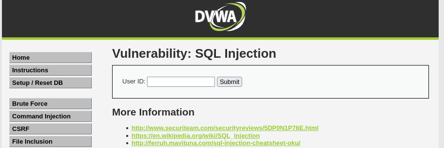

### Observações e interpretação

O código do Impossible usa **prepared statements** (queries parametrizadas). A estrutura da query é definida à partida e fica fixa; o input viaja sempre como **dado**, nunca como código. Por isso a base de dados foi procurar, literalmente, um utilizador cujo ID fosse a *string* `1' OR '1'='1' #` — como não existe, devolveu vazio. O input nunca "saiu da jaula" para virar comando, que era a raiz da vulnerabilidade nos três níveis anteriores. O Impossible acrescenta ainda validação de tipo (o ID tem de ser inteiro) e um token anti-CSRF (`user_token` no URL), mas a defesa que mata o SQL Injection é o prepared statement.

Lição que fecha o ciclo: **os níveis Low/Medium/High/Impossible não são configurações que ligam/desligam proteções — são versões diferentes do código-fonte.** Só o Impossible foi escrito com prepared statements; se o Low os usasse, o ataque teria falhado logo aí. No mundo real não há "níveis": uma aplicação ou tem o código escrito de forma segura (à Impossible) ou não. Os prepared statements não são um "modo", são uma **prática de programação** universal.

### Deduções e raciocínio (certos e corrigidos)

- **Dedução certa:** previ, antes de testar, que o ataque ia falhar porque o Impossible usa prepared statements — mesmo sem ter a certeza total. Confirmou-se.
- **Dedução corrigida:** perguntei se esta defesa "só funciona no modo Impossible". O pressuposto estava errado — pensava que os níveis eram configurações que ativam proteções. Percebi que são versões diferentes do código, e que os prepared statements funcionam em **qualquer** aplicação, não só no Impossible. Uma dedução parcialmente errada que virou compreensão — registada de propósito, porque o percurso do raciocínio também é aprendizagem.

**Consigo explicar isto a alguém?**
  Porque é que a caixa devolveu vazio (prepared statements, o input tratado como dado) e porque é que a defesa é universal e não um "modo": **Sim** — por palavras minhas.

### Como nos podemos defender

Esta entrada **é** a demonstração da defesa: prepared statements / parameterized queries, reforçados por validação de tipo de input e token anti-CSRF. É o contraste direto com as Entradas #11, #13 e #15 (Low, Medium, High), onde a ausência desta prática permitiu o ataque.

### Domínios relacionados

- **Security+ — D2 / D4:** Injection (A03 do OWASP Top 10) e as práticas de codificação segura que a mitigam
- **CEH — D5 (Web Server e Web Application Hacking):** confirmação de que uma defesa correta anula a exploração
- **ISO/IEC 27001 — Anexo A:** A.8.28 (codificação segura), A.8.25 (ciclo de desenvolvimento seguro)
- **NIS2:** desenvolvimento seguro e tratamento de vulnerabilidades (Art.º 21)

### O que correu mal / faltou

- Nada de relevante no exercício em si — correu limpo. Antes de começar, o Kali tinha ~190 atualizações pendentes (normal numa distribuição *rolling release*); instaladas e snapshot tirado antes do exercício.
- Nota de método: a rede do Kali, desta vez, já estava correta ao arrancar (não reverteu para a rede de casa) — a confirmar se se mantém nas próximas sessões.

### Próximos passos

- [ ] Fechado o capítulo do SQL Injection (Low → Medium → High → Impossible). Escolher o próximo módulo do DVWA (sugestões: SQL Injection Blind, ou Command Injection, mantendo o padrão Low → Impossible)
- [ ] Considerar consolidar num quadro-resumo a comparação dos quatro níveis (payload, defesa, resultado)

---

## Entrada #17 — Command Injection (nível Low)

**Data/hora:** 2026-08-12

**Máquinas ligadas:** OPNsense (gateway/DHCP do segmento Ciber), Kali Atacante (`192.168.10.102`), Servidor Vulnerável (`192.168.10.101`)

### Objetivo / Propósito

Arrancar o próximo módulo do roteiro depois de fechar o SQL Injection: Command Injection, nível Low. Perceber como o input pode escapar não para uma query SQL, mas para a **shell do sistema operativo** do servidor.

### Ação executada

1. DVWA Security → Low. Módulo Command Injection (`/vulnerabilities/exec/`): formulário "Ping a device" que pede um endereço IP.
2. **Caso de controlo:** `127.0.0.1` → ping normal (4 respostas). A página funciona como esperado.
3. **Injeção:** encadeando comandos com `;`:
   ```
   127.0.0.1; whoami            → ping + www-data
   127.0.0.1; whoami; hostname  → ping + www-data + 2a0f9de87992
   127.0.0.1; ls -la            → ping + listagem (help, index.php, source), tudo www-data
   ```

### Resultado

Cada comando encadeado com `;` foi executado no sistema operativo do servidor, a seguir ao ping. Descobertas por uma caixa que só pedia um IP:
- **`www-data`** — o utilizador com que o servidor web corre (conta de baixo privilégio).
- **`2a0f9de87992`** — o hostname, que é uma string hexadecimal aleatória: assinatura de um **container Docker**. Bate certo com o ID do container do DVWA registado na Entrada #14 — ou seja, confirmei, do lado do atacante, que o alvo corre dentro de Docker.
- **Listagem de ficheiros** da aplicação (`index.php`, `help`, `source`), acessível via `ls -la`.

**Screenshots guardados:**

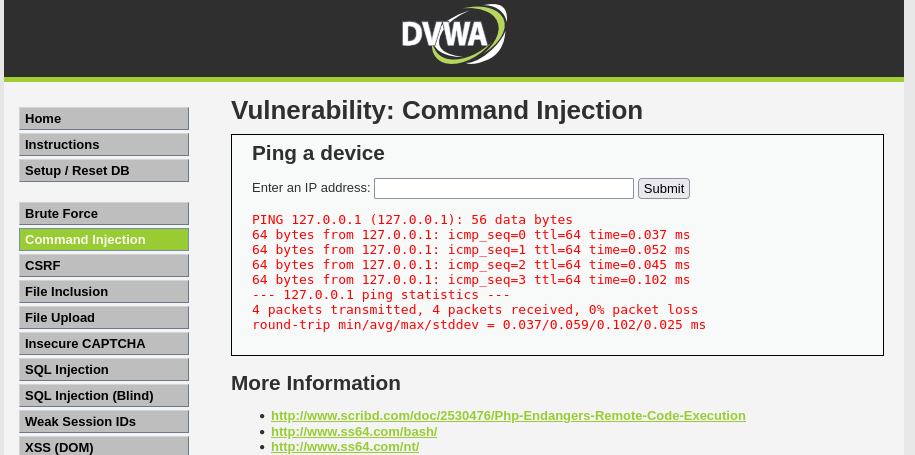

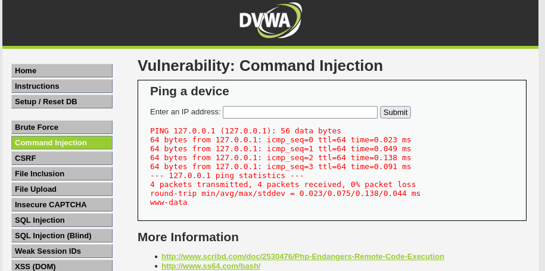

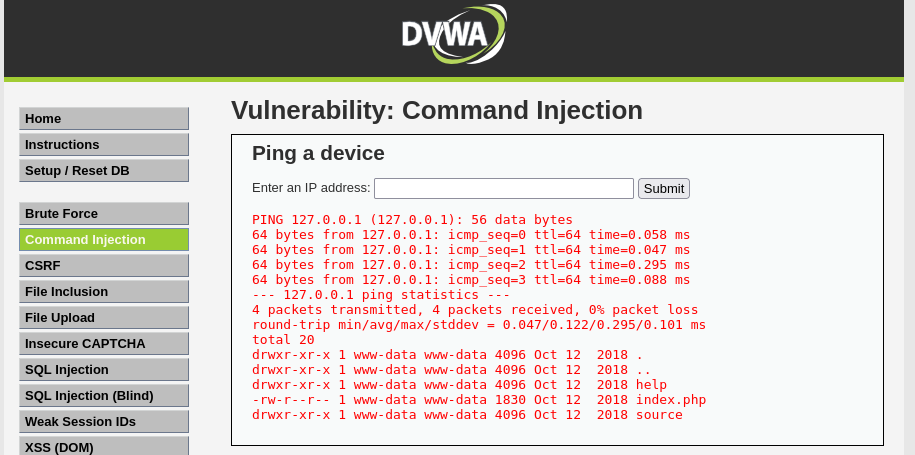

### Observações e interpretação

A página constrói um comando de sistema do tipo `ping -c 4 <input>` e executa-o na shell. Sem filtragem, o `;` (e outros como `&&` ou `|`) permite **encadear** um comando próprio a seguir ao ping. A raiz é a mesma do SQL Injection — input tratado como código, não como dado — mas o alvo é diferente: em vez da base de dados, é a **shell do sistema operativo**. Por isso é mais perigoso: não se roubam apenas dados, obtém-se **execução de comandos no servidor** (RCE — *Remote Code Execution*, como sugere o primeiro link "More Information" da própria página).

### Deduções e raciocínio (certos e corrigidos)

- **Intuição inicial (certa):** ao ver a caixa que pedia um IP para "ping", deduzi que era um sítio onde se podia injetar um comando. Apontava para o mecanismo certo.
- **Previsão certa:** previ que, ao injetar, ia ver o resultado do comando por baixo do ping. Confirmou-se (`www-data`).
- **Confusão que virou compreensão:** fiquei baralhado porque no output não aparecia a palavra "whoami" — cheguei a dizer "não existe whoami". Percebi depois que um comando **não mostra o próprio nome, só o resultado**: `www-data` *é* a resposta do `whoami` (à pergunta "quem sou eu?"). Foi o meu principal salto de compreensão nesta sessão.
- **Ligação feita:** identifiquei `www-data` como utilizador e `2a0f9de87992` como hostname — e reconheci este último como o ID do container Docker da minha Entrada #14.

**Consigo explicar isto a alguém?**
  Porque é que o servidor executou o `whoami`/`hostname`/`ls` quando a caixa só pedia um IP (o `;` encadeia comandos na shell e o input não é validado), e que a saída de um comando é o seu *resultado*, não o seu nome: **Sim** — por palavras minhas.

### Como nos podemos defender

- **Validação de input:** aceitar apenas o formato esperado (um IP válido) e rejeitar caracteres de shell (`;`, `&&`, `|`, `` ` ``, `$()`).
- **Nunca passar input do utilizador diretamente à shell:** usar funções/APIs que não invoquem uma shell, ou bibliotecas próprias para a tarefa (ex.: fazer o ping por código, não por comando de sistema).
- **Em PHP:** `escapeshellarg()` / `escapeshellcmd()` como reforço (defesa parcial); o nível Impossible deste módulo usa validação estrita do formato do IP.
- **Menor privilégio:** o servidor correr como `www-data` (e não root) limita o estrago de uma exploração — como se confirmou.

### Domínios relacionados

- **Security+ — D2 (Ameaças/Vulnerabilidades):** Command Injection; D4 — codificação segura e validação de input
- **CEH — D5 (Web Application Hacking):** RCE via command injection; reconhecimento (descoberta de que o alvo é um container)
- **ISO/IEC 27001 — Anexo A:** A.8.28 (codificação segura)
- **NIS2:** desenvolvimento seguro e tratamento de vulnerabilidades (Art.º 21)

### O que correu mal / faltou

- Momento de confusão com o output do `whoami` (não ver o nome do comando na resposta) — esclarecido, e registado de propósito como aprendizagem.
- Por fazer: os níveis **Medium** e **High** deste módulo, para ver como o payload se adapta quando começam a filtrar caracteres.

### Próximos passos

- [x] Command Injection nível Medium — filtragem observada e contornada (Entrada #18, 2026-08-12)
- [ ] Command Injection nível High — próximo
- [ ] Comparar com o código do nível Impossible do módulo, para ver a defesa correta (validação estrita do IP)

---

## Entrada #18 — Command Injection (nível Medium)

**Data/hora:** 2026-08-12

**Máquinas ligadas:** OPNsense (gateway/DHCP do segmento Ciber), Kali Atacante (`192.168.10.102`), Servidor Vulnerável (`192.168.10.101`)

### Objetivo / Propósito

Repetir o ataque de Command Injection no nível Medium para ver que defesa é introduzida e por onde ainda se pode passar — tal como se fez no SQL Injection Medium.

### Ação executada

1. DVWA Security → Medium. Módulo Command Injection.
2. **Repetir o payload do Low:** `127.0.0.1; whoami` → devolveu **só o ping**, sem `www-data`. O ataque do Low deixou de funcionar.
3. **Testar operadores alternativos**, um a um:
   ```
   127.0.0.1 | whoami    → www-data          (PASSA — pipe)
   127.0.0.1 && whoami   → só o ping          (BLOQUEADO)
   127.0.0.1 & whoami    → ping + www-data    (PASSA — segundo plano)
   ```

### Resultado

O Medium tem um filtro que **apaga** certos caracteres do input: o `;` e o `&&` (por isso o payload do Low e o `&&` falharam). Mas o filtro **esqueceu** o `|` e o `&` sozinho — ambos permitiram executar o `whoami` e obter `www-data`. Defesa contornada por dois caminhos diferentes.

**Screenshots guardados:**


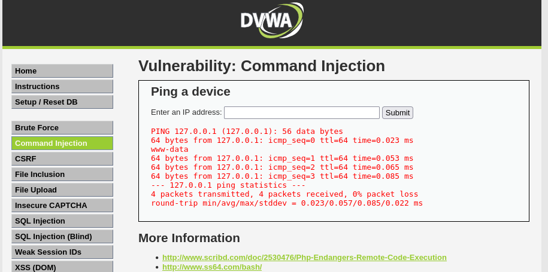

### Observações e interpretação

A defesa do Medium é uma **blacklist**: uma lista de caracteres proibidos que o código apaga do input (aqui, `;` e `&&`). A blacklist tem uma fraqueza estrutural — é quase impossível listar *tudo* o que é perigoso. Basta esquecer um caractere e a porta fica aberta, como aconteceu com o `|` e o `&`. A alternativa robusta é uma **whitelist**: em vez de "proíbe estes", diz "só permite exatamente isto" (ex.: só dígitos e pontos de um IP válido) — e aí não há como escapar.

Cada operador de shell tem a sua mecânica, o que também explica diferenças no output:
- `;` — executa em **sequência** (comando 1, depois comando 2); ambos escrevem no ecrã.
- `|` (pipe) — canaliza a **saída** do primeiro como **entrada** do segundo; por isso, com `| whoami`, o output do ping é "engolido" pelo `whoami` (que o ignora) e só se vê o `www-data`.
- `&` — põe o primeiro comando em **segundo plano** e corre o segundo em simultâneo; por isso se vê o ping **e** o `www-data`.

### Deduções e raciocínio (certos e corrigidos)

- **Previsão inicial errada:** previ que "não ia mudar nada de significativo, por analogia com o SQL Injection Medium". Ao testar o payload do Low e não ver o `www-data`, **corrigi**: afinal há filtragem, o `;` é apagado. Boa lição sobre não assumir que a analogia se aplica sempre.
- **Dedução certa:** propus o `|` como caractere alternativo e previ que, se passasse, o `www-data` teria de aparecer. Confirmou-se.
- **Pergunta que gerou aprendizagem:** ao ver que o `|` só devolvia o `www-data` (sem o ping), perguntei porque é que "o resto desaparecia". Percebi a mecânica do pipe — o output do ping foi canalizado para o `whoami`, não desapareceu.
- **Confirmação da fragilidade da blacklist:** testei `&&` (bloqueado) vs `&` (passa) e vi ao vivo que bloquearam um "irmão" mas esqueceram o outro.

**Consigo explicar isto a alguém?**
  A diferença entre blacklist e whitelist, porque é que a blacklist do Medium é frágil, e a mecânica dos operadores `;`/`|`/`&`: **Sim** — por palavras minhas.

### Como nos podemos defender

- **Whitelist em vez de blacklist:** validar que o input tem *exatamente* o formato de um IP (só dígitos e pontos, quatro octetos) e rejeitar tudo o resto. É a defesa correta, e é o que o nível Impossible do módulo faz.
- **Não passar input do utilizador à shell:** usar código/bibliotecas próprias em vez de construir um comando de sistema.
- **Menor privilégio:** o servidor correr como `www-data` limita o estrago.

### Domínios relacionados

- **Security+ — D2 / D4:** Command Injection; validação de input (whitelist vs blacklist) como controlo de codificação segura
- **CEH — D5 (Web Application Hacking):** evasão de filtros / bypass de blacklist
- **ISO/IEC 27001 — Anexo A:** A.8.28 (codificação segura)
- **NIS2:** desenvolvimento seguro e tratamento de vulnerabilidades (Art.º 21)

### O que correu mal / faltou

- Nada falhou no exercício — correu limpo e didático. A previsão inicial errada ("não muda nada") foi útil: mostrou, na prática, que cada vulnerabilidade se defende à sua maneira.
- Por fazer: o nível **High** deste módulo, e comparar com o **Impossible** (a whitelist na prática).

### Próximos passos

- [x] Command Injection nível High — filtragem maior contornada com `&` e `|` sem espaço (Entrada #19, 2026-08-12)
- [ ] Comparar com o nível Impossible do módulo (validação estrita do IP = whitelist)

---

## Entrada #19 — Command Injection (nível High)

**Data/hora:** 2026-08-12

**Máquinas ligadas:** OPNsense (gateway/DHCP do segmento Ciber), Kali Atacante (`192.168.10.102`), Servidor Vulnerável (`192.168.10.101`)

### Objetivo / Propósito

Fechar o módulo Command Injection no nível High: ver que filtragem mais apertada é introduzida e se ainda há forma de a contornar.

### Ação executada

1. Confirmada a ligação ao alvo (`ping 192.168.10.101` → 0% packet loss) e DVWA Security → High.
2. **Testar os bypasses do Medium:**
   ```
   127.0.0.1 | whoami    → só o ping           (BLOQUEADO — o `| ` com espaço foi filtrado)
   127.0.0.1 & whoami    → ping + www-data      (AINDA PASSA — o `&` não foi bloqueado)
   ```
3. **Caçar a brecha do pipe:** como o filtro apaga `| ` (pipe *com espaço*), testar sem espaço:
   ```
   127.0.0.1|whoami      → www-data             (PASSA — sem o espaço, a sequência filtrada não existe)
   ```

### Resultado

O High tem uma blacklist maior que o Medium — passou a apanhar o `| ` (pipe com espaço), que era bypass no Medium. Mas continua a ser blacklist e continua furada: o `&` sozinho ainda funciona, e o `|` **sem espaço** também. Módulo Command Injection explorado do Low ao High, sempre com a mesma fraqueza de fundo.

**Screenshots guardados:**

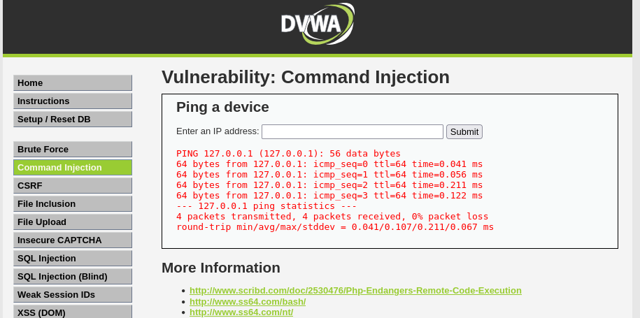

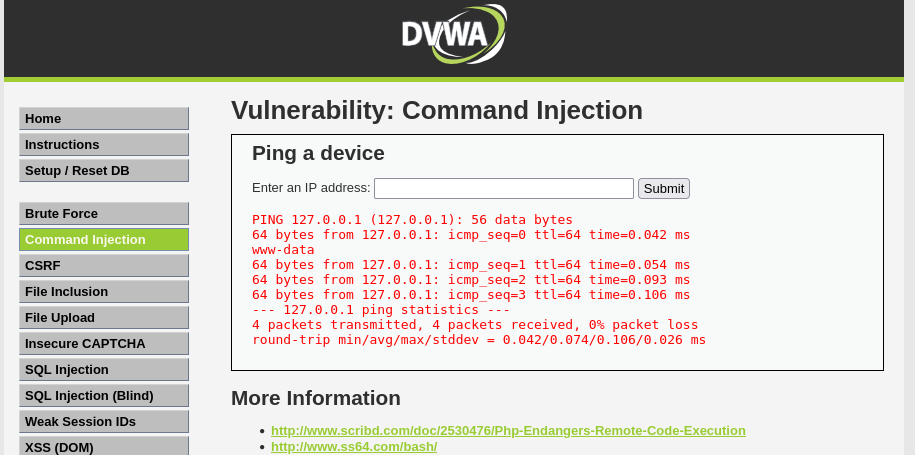

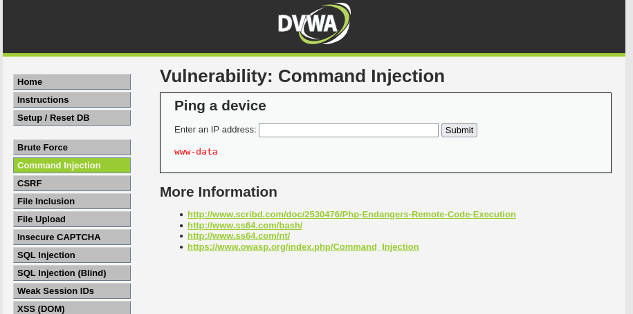

### Observações e interpretação

A defesa do High procura sequências de caracteres específicas para apagar — nomeadamente `| ` (pipe **seguido de espaço**). O detalhe é revelador: ao tirar o espaço (`|whoami`), a sequência que o filtro procura deixa de existir e o pipe passa. **Um único espaço** é a diferença entre a defesa funcionar e falhar. É a demonstração máxima da fragilidade da blacklist — não basta pensar nos caracteres perigosos, é preciso antecipar todas as *variações* de como os escrever, o que é humanamente impossível. Por isso a defesa correta é a **whitelist** (só aceitar o formato de um IP válido).

Os diferentes operadores de shell (`;`, `&&`, `||`, `&`, `|`, `` ` ``/`$()`) têm comportamentos distintos, o que explica também as diferenças no output observadas ao longo do módulo. A tabela de referência e a consolidação completa do módulo estão em [`guias-estudo/guia-estudo-command-injection.md`](guias-estudo/guia-estudo-command-injection.md) (para não duplicar aqui).

### Deduções e raciocínio (certos e corrigidos)

- **Previsão certa:** antes de testar, previ que o High seria "mais restrito, mas que haveria sempre uma brecha (qual, não sabia)". Confirmou-se em cheio — tapou o `| ` mas deixou o `&` e o `|` sem espaço.
- **Erro de leitura, corrigido:** ao testar `& whoami`, li mal o ecrã e pensei que tinha sido bloqueado. Ao reconfirmar, vi que o `www-data` apareceu — corrigi a observação antes de tirar qualquer conclusão. (Lição de método: confirmar bem o que se vê antes de concluir.)
- **Síntese própria:** pesquisei os operadores de shell e percebi que cada um tem um comportamento diferente — sem decorar, sabendo que se consulta. Conclusão registada no guia de estudo.

**Consigo explicar isto a alguém?**
  Porque é que o High é mais restrito mas ainda se contorna, e porque é que um simples espaço engana o filtro: **Sim** — por palavras minhas.

### Como nos podemos defender

- **Whitelist** em vez de blacklist: aceitar apenas o formato de um IP válido (dígitos e pontos) e recusar tudo o resto. É a única defesa que não depende de "lembrar todos os caracteres perigosos".
- Não passar input do utilizador à shell; menor privilégio (`www-data`).
- É o que o nível **Impossible** do módulo implementa — a comparar numa próxima sessão.

### Domínios relacionados

- **Security+ — D2 / D4:** Command Injection; validação de input (whitelist vs blacklist)
- **CEH — D5 (Web Application Hacking):** evasão de filtros / bypass de blacklist por variação de sintaxe
- **ISO/IEC 27001 — Anexo A:** A.8.28 (codificação segura)
- **NIS2:** desenvolvimento seguro e tratamento de vulnerabilidades (Art.º 21)

### O que correu mal / faltou

- Um erro de leitura do ecrã (pensar que o `&` tinha sido bloqueado), corrigido ao reconfirmar — registado de propósito como aprendizagem de método.
- Por fazer: o nível **Impossible** do módulo (a whitelist na prática), para fechar a comparação como no SQL Injection.

### Próximos passos

- [x] Command Injection nível Impossible — ver a whitelist a recusar todos os bypasses (Entrada #20, 2026-08-12)
- [ ] Avançar para o próximo módulo do roteiro (XSS)

---

## Entrada #20 — Command Injection (nível Impossible)

**Data/hora:** 2026-08-12

**Máquinas ligadas:** OPNsense (gateway/DHCP do segmento Ciber), Kali Atacante (`192.168.10.102`), Servidor Vulnerável (`192.168.10.101`)

### Objetivo / Propósito

Fechar o módulo Command Injection: submeter no nível Impossible os bypasses que funcionaram no High e confirmar que **falham**, percebendo o mecanismo da whitelist.

### Ação executada

1. DVWA Security → Impossible, módulo Command Injection.
2. **Caso de controlo:** `127.0.0.1` (só o IP) → ping normal. A whitelist aceita.
3. **Testar os bypasses do High** (e variações):
   ```
   127.0.0.1 & whoami   → ERROR: You have entered an invalid IP.
   127.0.0.1|whoami     → ERROR: You have entered an invalid IP.
   ```
   Qualquer input com caracteres para além de um IP válido devolve **sempre o mesmo erro**.

### Resultado

Todos os bypasses falharam. Só um IP válido é aceite; qualquer acréscimo de caracteres (`&`, `|`, `;`, `whoami`, com ou sem espaço) devolve invariavelmente `ERROR: You have entered an invalid IP.` — nada é executado. Módulo Command Injection fechado (Low → Medium → High → Impossible).

**Screenshots guardados:**


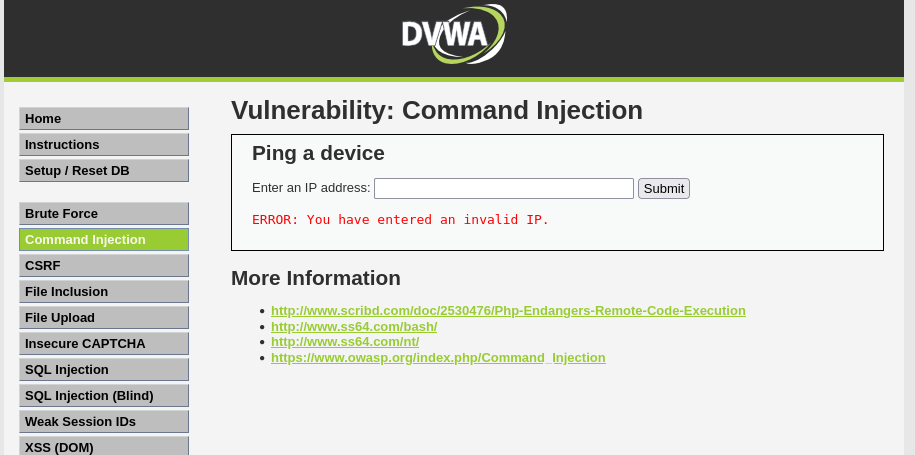

### Observações e interpretação

O Impossible usa uma **whitelist**: em vez de bloquear caracteres perigosos, valida que o input tem *exatamente* o formato de um IP e recusa tudo o resto. O detalhe mais revelador — e que se observou na prática — é que **todos** os bypasses dão o **mesmo** resultado (`invalid IP`), ao contrário do High, onde cada caractere dava um resultado diferente. Esse resultado uniforme é a **assinatura de uma whitelist**: a defesa não pergunta "este caractere é perigoso?" (o que deixa sempre buracos), pergunta "isto é um IP válido?" — e a resposta é não para tudo o que não seja um IP. Não há variação de sintaxe que a contorne, porque não existe uma lista de proibições para furar. É o oposto exato da fragilidade da blacklist do High.

Fecha-se assim a comparação dos quatro níveis, paralela à do SQL Injection: Low (sem defesa) → Medium/High (blacklists cada vez maiores, mas sempre furáveis) → Impossible (whitelist, a defesa correta e incontornável).

### Deduções e raciocínio (certos e corrigidos)

- **Previsão certa:** previ que o Impossible "não ia deixar passar nada". Confirmou-se.
- **Observação-chave (própria):** notei que, ao acrescentar quaisquer caracteres, o resultado era **sempre o mesmo** erro `invalid IP` — e questionei se seria um bug. Percebi que não é bug nenhum: o resultado uniforme é exatamente a prova de que a defesa é uma whitelist (rejeita tudo o que não é um IP), e não uma blacklist (que daria resultados diferentes por caractere). Boa dedução, que distingue os dois tipos de defesa pelo comportamento observável.

**Consigo explicar isto a alguém?**
  O que é uma whitelist, porque é incontornável por variação de sintaxe, e como o resultado uniforme a denuncia face a uma blacklist: **Sim** — por palavras minhas.

### Como nos podemos defender

Esta entrada **é** a demonstração da defesa correta: uma whitelist que valida o formato do input (só um IP válido) e recusa tudo o resto. É o contraste direto com as Entradas #17–#19 (Low/Medium/High), onde a ausência desta abordagem — ou o uso de blacklists — permitiu o ataque.

### Domínios relacionados

- **Security+ — D2 / D4:** validação de input por whitelist como controlo de codificação segura
- **CEH — D5 (Web Application Hacking):** confirmação de que uma defesa correta anula a exploração
- **ISO/IEC 27001 — Anexo A:** A.8.28 (codificação segura)
- **NIS2:** desenvolvimento seguro e tratamento de vulnerabilidades (Art.º 21)

### O que correu mal / faltou

- **Reincidência do bug da Entrada #13:** ao pôr o nível em Impossible, o módulo Command Injection continuava a mostrar `low`. Causa: cookies `security` **duplicadas com paths diferentes** (a antiga `low` num path mais específico prevalecia sobre a nova `impossible` no path `/`). Resolvido apagando a cookie antiga via DevTools → Storage → Cookies e fazendo hard refresh (Ctrl+Shift+R) — aplicando o que já estava documentado na Entrada #13. Lição de método: o diário paga dividendos — documentado uma vez, resolvido em minutos na segunda.

### Próximos passos

- [x] Iniciar o próximo módulo do roteiro: **XSS (Reflected)** nível Low (Entrada #21, 2026-08-12)
- [ ] XSS (Reflected) níveis Medium/High/Impossible, depois Stored e DOM
- [ ] (Opcional) consolidar num quadro-resumo comparativo os módulos já fechados (SQL Injection e Command Injection)

---

## Entrada #21 — XSS Reflected (nível Low)

**Data/hora:** 2026-08-12

**Máquinas ligadas:** OPNsense (gateway/DHCP do segmento Ciber), Kali Atacante (`192.168.10.102`), Servidor Vulnerável (`192.168.10.101`)

### Objetivo / Propósito

Iniciar o módulo XSS (Cross-Site Scripting), começando pela variante **Reflected** no nível Low. Perceber a mudança de paradigma: o alvo já não é o servidor (base de dados ou SO), é o **browser de outro utilizador**.

*Nota honesta: comecei este módulo sem saber praticamente nada de XSS (tinha só uma ideia vaga e errada). Fica registado como ponto de partida.*

### Ação executada

1. DVWA Security → Low. Módulo **XSS (Reflected)** — formulário "What's your name?".
2. **Caso de controlo:** `Pedro` → a página respondeu "Hello Pedro" (colou o input diretamente na página).
3. **Injeção de script:**
   ```
   <script>alert('XSS')</script>
   ```
   → apareceu um **popup** com "XSS". O browser executou o JavaScript injetado em vez de o mostrar como texto.
4. **Prova do perigo — leitura da cookie de sessão:**
   ```
   <script>alert(document.cookie)</script>
   ```
   → o popup mostrou `PHPSESSID=jvtmtpcpp9444t45ihq1cmh587; security=low`.

### Resultado

O input não foi tratado como texto, mas **executado como código** no browser. Com `document.cookie`, foi possível **ler a cookie de sessão** (`PHPSESSID`) — a chave que identifica a sessão autenticada. Num ataque real, essa cookie seria enviada em silêncio para o servidor do atacante (não um popup), permitindo *session hijacking* (assumir a identidade da vítima sem a password).

**Screenshots guardados:**

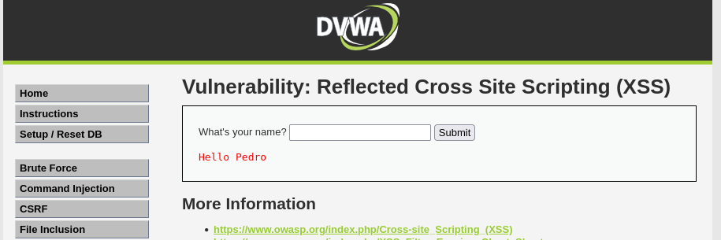

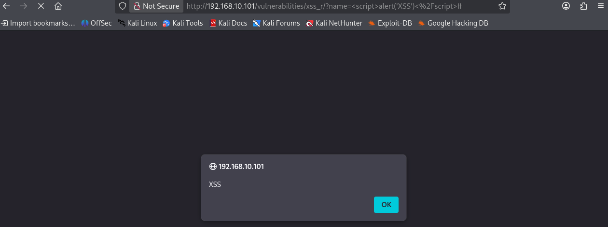

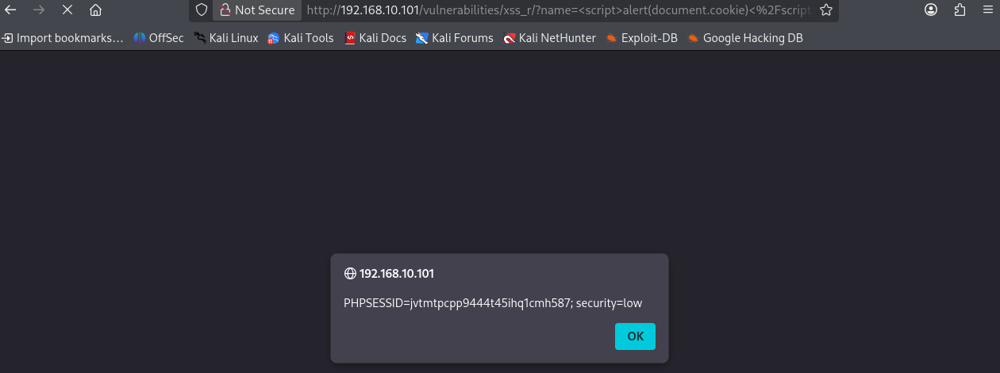

### Observações e interpretação

**A mudança de paradigma:** no SQLi e no Command Injection, o input escapava para uma query SQL ou um comando do SO — a vítima era o servidor. No XSS, o input escapa para o **HTML/JavaScript da página**, e o código corre no **browser de quem a abre**. A vítima é outro utilizador.

**Reflected:** o script é "refletido" de volta pelo servidor de imediato e viaja no **URL** (`?name=<script>...`). Num ataque real, o atacante coloca este URL num link e engana a vítima a clicar; o script corre na sessão dela.

**Ligação ao que já estava documentado (o diário a dar frutos):** o `document.cookie` conseguiu ler o `PHPSESSID` porque essa cookie **não tem a flag HttpOnly**. Isto já estava anunciado no próprio reconhecimento — o nmap da Entrada #8 reportava `httponly flag not set`. E o termo **HttpOnly** já estava no glossário ("impede uma cookie de ser lida por JavaScript, protegendo contra roubo de sessão via XSS") — deixou de ser teoria e passou a prática. Se a cookie tivesse HttpOnly, este ataque não a conseguiria ler.

### Deduções e raciocínio (certos e corrigidos)

- **Ponto de partida honesto:** comecei sem saber o que era XSS — tinha uma ideia vaga ("salta linhas") que estava errada. Registado de propósito.
- **Previsão certa:** ao injetar `<script>alert('XSS')</script>`, previ (com pista) que o browser executaria o código e apareceria um popup. Confirmou-se.
- **Previsão certa:** ao usar `document.cookie`, previ que apareceria a cookie de sessão. Confirmou-se — reação imediata: "estou desprotegido".
- **Compreensão nova:** percebi que a gravidade do XSS não é o popup, é o que ele *prova* — que se pode correr qualquer código no browser da vítima, incluindo roubar-lhe a sessão.

**Consigo explicar isto a alguém?**
  O que é XSS, porque é que a vítima é o utilizador e não o servidor, e como o roubo da cookie leva a *session hijacking*: **Sim** — por palavras minhas (apesar de ter começado o módulo sem saber).

### Como nos podemos defender

- **Output encoding / escaping (defesa principal):** a página deve "escapar" o input antes de o mostrar — transformar `<` em `&lt;`, `>` em `&gt;`, etc. — para o browser o exibir como *texto* em vez de o executar como código.
- **HttpOnly na cookie de sessão:** impede o JavaScript de ler o `PHPSESSID`, bloqueando o roubo de sessão via XSS (mitiga a consequência, mesmo que o XSS exista).
- **Content Security Policy (CSP):** política que restringe que scripts o browser pode executar, como camada de reforço.
- **Validação de input** onde aplicável.

### Domínios relacionados

- **Security+ — D2 (Ameaças/Vulnerabilidades):** XSS (A03/A07 do OWASP Top 10); D4 — codificação segura (output encoding)
- **CEH — D5 (Web Application Hacking):** XSS e roubo de sessão (*session hijacking*)
- **ISO/IEC 27001 — Anexo A:** A.8.28 (codificação segura)
- **NIS2:** desenvolvimento seguro e tratamento de vulnerabilidades (Art.º 21)

### O que correu mal / faltou

- Nada falhou tecnicamente. Ponto de partida honesto documentado: comecei sem saber XSS. É suposto — é um diário de aprendizagem.
- Por fazer: níveis Medium/High/Impossible do Reflected, e as variantes **Stored** (script guardado no servidor, corre para todos os visitantes) e **DOM**.

### Próximos passos

- [x] XSS Reflected nível Medium — filtro de `<script>` contornado com `` (Entrada #22, 2026-08-12)
- [ ] XSS Reflected níveis High → Impossible
- [ ] XSS Stored e DOM
- [ ] (Opcional) demonstrar o roubo de cookie "a sério" (enviar para um servidor de captura no Kali), em vez do `alert`

---

## Entrada #22 — XSS Reflected (nível Medium)

**Data/hora:** 2026-08-12

**Máquinas ligadas:** OPNsense (gateway/DHCP do segmento Ciber), Kali Atacante (`192.168.10.102`), Servidor Vulnerável (`192.168.10.101`)

### Objetivo / Propósito

Repetir o XSS Reflected no nível Medium para ver que defesa é introduzida e como contorná-la.

### Ação executada

1. DVWA Security → Medium. Módulo XSS (Reflected).
2. **Repetir o payload do Low:**
   ```
   <script>alert('XSS')</script>
   ```
   → **sem popup**. A página mostrou "Hello alert('XSS')" — a etiqueta `<script>` foi **apagada**, deixando só o texto `alert('XSS')` (sem etiqueta, o browser não executa).
3. **Bypass — usar JavaScript sem `<script>`:**
   ```
   
   ```
   → **popup "XSS"**. Defesa contornada.

### Resultado

O Medium remove a string `<script>` do input (blacklist). O payload do Low deixou de funcionar, mas bastou correr JavaScript **sem** usar `<script>` para contornar: uma imagem com `src` inválido dispara o gestor de evento `onerror`, que executa o código. Nenhuma etiqueta `<script>` presente → o filtro não tem o que apagar.

**Screenshots guardados:**

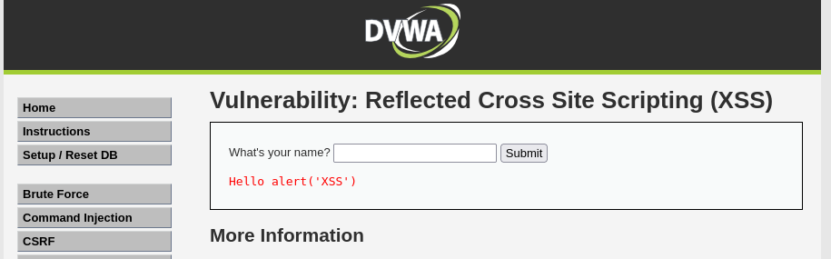


### Observações e interpretação

O payload do bypass, peça a peça (para referência, dado que não domino programação):
- `` — etiqueta HTML que normalmente mostra uma imagem; é uma instrução para o browser, não texto.
- `src=x` — o `src` (source) é *onde está a imagem*; `x` é um endereço falso de propósito, para a imagem **falhar** a carregar.
- `onerror=...` — *event handler* ("quando der erro"): "se algo correr mal a carregar a imagem, faz o seguinte".
- `alert('XSS')` — o código que corre quando o erro acontece (o popup).

A lição central: **`<script>` não é a única forma de executar JavaScript.** Vários gestores de evento (`onerror`, `onclick`, `onmouseover`, `onload`...) disparam código a partir de outras etiquetas. Por isso, bloquear só `<script>` (blacklist) nunca cobre todas as formas — é a mesma fraqueza do Command Injection Medium, agora no mundo do HTML/JavaScript. O payload `` é uma "chave-mestra": funciona no Low (sem filtro) **e** no Medium (que só sabe apagar `<script>`).

### Deduções e raciocínio (certos e corrigidos)

- **Previsão certa:** previ que o Medium "ia subir a defesa mas não o suficiente para bloquear" (assinatura de uma blacklist). Confirmou-se — bloqueou o `<script>` mas não o ``.
- **Compreensão nova:** percebi que o *resultado* (popup) é o mesmo do Low, mas o *caminho* é diferente (janela lateral em vez da porta da frente), e que o payload `` também funcionaria no Low, porque lá não há filtro nenhum.
- **Nota de método pessoal:** não sei programar, e tenho dificuldade em criar/entender payloads. Ficou registada a decomposição peça a peça do `` para consulta futura — o objetivo é *perceber o que o payload faz*, não decorá-lo.

**Consigo explicar isto a alguém?**
  Que a defesa do Medium apaga `<script>`, e que se contorna porque há outras formas de correr JavaScript (event handlers como `onerror`): **Sim** — por palavras minhas.

### Como nos podemos defender

- **Output encoding / escaping (defesa principal):** escapar o input (`<` → `&lt;`, etc.) para o browser o mostrar como texto, em vez de tentar apagar etiquetas específicas. Uma blacklist de etiquetas (como a do Medium) está condenada a falhar, porque há inúmeras formas de correr JavaScript.
- **Content Security Policy (CSP)** como reforço.

### Domínios relacionados

- **Security+ — D2 / D4:** XSS; codificação segura (output encoding); evasão de blacklist
- **CEH — D5 (Web Application Hacking):** bypass de filtros de XSS por etiquetas/eventos alternativos
- **ISO/IEC 27001 — Anexo A:** A.8.28 (codificação segura)
- **NIS2:** desenvolvimento seguro e tratamento de vulnerabilidades (Art.º 21)

### O que correu mal / faltou

- Nada falhou. Nota honesta: como não programo, a criação e leitura dos payloads é a minha maior dificuldade — mitigada com a decomposição peça a peça, registada na entrada.
- Por fazer: níveis High e Impossible do Reflected, e as variantes Stored e DOM.

### Próximos passos

- [x] XSS Reflected nível High — `` ainda passa; `<script>` bloqueado em qualquer forma (Entrada #23, 2026-08-12)
- [ ] XSS Reflected Impossible (a defesa correta — output encoding)

---

## Entrada #23 — XSS Reflected (nível High)

**Data/hora:** 2026-08-12

**Máquinas ligadas:** OPNsense (gateway/DHCP do segmento Ciber), Kali Atacante (`192.168.10.102`), Servidor Vulnerável (`192.168.10.101`)

### Objetivo / Propósito

Repetir o XSS Reflected no nível High para ver que filtragem mais apertada é usada e se ainda se contorna.

### Ação executada

1. DVWA Security → High. Módulo XSS (Reflected).
2. **Bypass do Medium (``):**
   ```
   
   ```
   → **popup "XSS"**. Ainda passa.
3. **Variação de `<script>` (Caminho A, que passaria no Medium):**
   ```
   <ScRiPt>alert('XSS')</ScRiPt>
   ```
   → **bloqueado**. Sem popup; a página mostra só "Hello >" (o filtro apagou a parte do "script").

### Resultado

O `` continua a funcionar (bypass), mas a variação de maiúsculas de `<script>` deixou de funcionar. O High melhorou o filtro do "script" mas continua cego a tudo o que não seja "script".

**Screenshots guardados:**

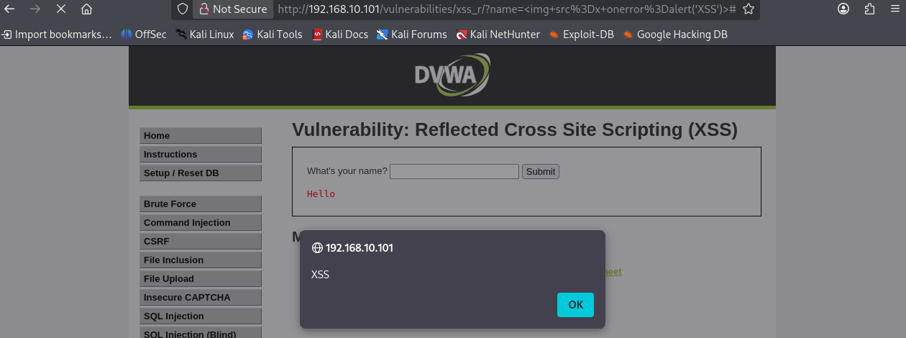

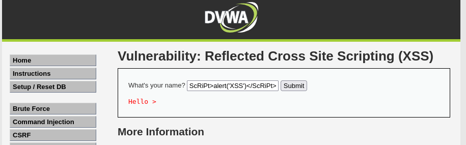

### Observações e interpretação

**O que o High melhorou:** no Medium, o filtro apagava apenas o `<script>` exato (minúsculas), pelo que uma variação como `<ScRiPt>` passaria. No High, o filtro apanha "script" em **qualquer combinação de maiúsculas/minúsculas** (e até com caracteres pelo meio) — fechou a variação de `<script>` (Caminho A).

**O que o High NÃO mudou:** continua a pensar apenas na palavra "script". Nunca considerou que o XSS **não precisa de `<script>`**. Por isso etiquetas alternativas com event handlers — ``, `<svg onload>`, `<body onload>` — passam-lhe ao lado (Caminho B).

O padrão é o mesmo dos outros módulos: o programador **tapou o buraco específico que conhecia** (variações de `<script>`), mas mantém uma **blacklist** — bloquear coisas-más-conhecidas — o que deixa a porta aberta a tudo o que não pensou. O `` é uma **chave-mestra**: funciona no Low, Medium **e** High. Para um atacante que saiba que o XSS vive de event handlers e não só de `<script>`, o High quase não é mais difícil que o Medium.

### Deduções e raciocínio (certos e corrigidos)

- **Previsão certa:** previ que o `` ainda passaria no High (por continuar a ser blacklist). Confirmou-se.
- **Demonstração dupla:** testei os dois caminhos e vi ao vivo que o High fechou o Caminho A (`<ScRiPt>` bloqueado) mas deixou o Caminho B (`` a passar) — a prova concreta de que a melhoria foi parcial e específica.

**Consigo explicar isto a alguém?**
  Que o High bloqueia "script" em qualquer forma mas não outras etiquetas/eventos, e porque é que isso mantém o XSS possível: **Sim** — por palavras minhas.

### Como nos podemos defender

- **Output encoding / escaping (defesa principal):** escapar o input para o browser o mostrar como texto, em vez de tentar apagar etiquetas específicas — que é uma corrida perdida, pois há inúmeras formas de correr JavaScript.
- **Content Security Policy (CSP)** como reforço.
- É o que o nível **Impossible** implementa — a comparar a seguir.

### Domínios relacionados

- **Security+ — D2 / D4:** XSS; codificação segura; evasão de blacklist
- **CEH — D5 (Web Application Hacking):** bypass de filtros de XSS por etiquetas/eventos alternativos
- **ISO/IEC 27001 — Anexo A:** A.8.28 (codificação segura)
- **NIS2:** desenvolvimento seguro e tratamento de vulnerabilidades (Art.º 21)

### O que correu mal / faltou

- Nada falhou. Por fazer: o nível **Impossible** do Reflected, e depois as variantes **Stored** e **DOM**.

### Próximos passos

- [ ] XSS Reflected Impossible — a defesa correta (output encoding), a ver o `` finalmente recusado
- [ ] XSS Stored e DOM

---

## Screenshots

Os prints ilustrativos de cada dia de trabalho ficam guardados em `screenshots/AAAA-MM-DD/`, referenciados a partir da entrada correspondente.

- `screenshots/2026-08-02/entrada06-dvwa-login-page.png` — página de login do DVWA após inicialização da base de dados
- `screenshots/2026-08-02/entrada07-dvwa-welcome-page.png` — página inicial do DVWA após login bem-sucedido
- `screenshots/2026-08-02/entrada08-nmap-pos-dvwa.png` — resultado do scan nmap pós-DVWA, mostrando a porta 80 aberta
- `screenshots/2026-08-02/entrada10-sqli-teste-normal.png` — teste normal do módulo SQL Injection (ID 1 → admin/admin)
- `screenshots/2026-08-02/entrada11-sqli-injecao-bem-sucedida.png` — injeção SQL bem-sucedida, devolvendo todos os 5 utilizadores
- `screenshots/2026-08-06/entrada13-sqli-medium-curl.png` — confirmação do SQL Injection Medium via `curl`, sem depender do browser
- `screenshots/2026-08-11/entrada15-sqli-high-5-utilizadores.png` — SQL Injection High bem-sucedido, devolvendo todos os 5 utilizadores
- `screenshots/2026-08-12/entrada16-sqli-impossible-ataque-falhado.png` — SQL Injection Impossible: mesmo payload do High devolve resultado vazio (ataque falhado por prepared statements)
- `screenshots/2026-08-12/entrada17-cmdinjection-controlo-ping.png` — Command Injection Low: caso de controlo, ping normal a 127.0.0.1
- `screenshots/2026-08-12/entrada17-cmdinjection-whoami.png` — Command Injection Low: injeção `; whoami` devolve `www-data`
- `screenshots/2026-08-12/entrada17-cmdinjection-ls.png` — Command Injection Low: injeção `; ls -la` lista os ficheiros da aplicação
- `screenshots/2026-08-12/entrada18-cmdinjection-medium-semicolon-filtrado.png` — Command Injection Medium: payload do Low (`; whoami`) filtrado, só devolve o ping
- `screenshots/2026-08-12/entrada18-cmdinjection-medium-pipe-bypass.png` — Command Injection Medium: bypass com `|` (pipe) devolve `www-data`
- `screenshots/2026-08-12/entrada18-cmdinjection-medium-doubleamp-bloqueado.png` — Command Injection Medium: `&&` bloqueado pela blacklist, só devolve o ping
- `screenshots/2026-08-12/entrada18-cmdinjection-medium-amp-bypass.png` — Command Injection Medium: bypass com `&` (segundo plano) devolve ping + `www-data`
- `screenshots/2026-08-12/entrada19-cmdinjection-high-pipe-espaco-bloqueado.png` — Command Injection High: `| whoami` (pipe com espaço) bloqueado pela blacklist maior
- `screenshots/2026-08-12/entrada19-cmdinjection-high-amp-bypass.png` — Command Injection High: `&` ainda passa, devolve ping + `www-data`
- `screenshots/2026-08-12/entrada19-cmdinjection-high-pipe-semespaco-bypass.png` — Command Injection High: `|whoami` (pipe sem espaço) contorna o filtro, devolve `www-data`
- `screenshots/2026-08-12/entrada20-cmdinjection-impossible-ip-valido.png` — Command Injection Impossible: só o IP válido é aceite e faz ping
- `screenshots/2026-08-12/entrada20-cmdinjection-impossible-ip-invalido-erro.png` — Command Injection Impossible: qualquer bypass devolve "invalid IP" (whitelist recusa tudo)
- `screenshots/2026-08-12/entrada21-xss-reflected-controlo-hello.png` — XSS Reflected Low: caso de controlo, nome `Pedro` devolve "Hello Pedro"
- `screenshots/2026-08-12/entrada21-xss-reflected-alert.png` — XSS Reflected Low: `<script>alert('XSS')</script>` executa e abre popup
- `screenshots/2026-08-12/entrada21-xss-reflected-cookie-roubada.png` — XSS Reflected Low: `document.cookie` lê a cookie de sessão (PHPSESSID), payload visível no URL
- `screenshots/2026-08-12/entrada22-xss-reflected-medium-script-filtrado.png` — XSS Reflected Medium: `<script>` apagado pelo filtro, aparece só "Hello alert('XSS')" como texto
- `screenshots/2026-08-12/entrada22-xss-reflected-medium-img-bypass.png` — XSS Reflected Medium: bypass com `` dispara o popup
- `screenshots/2026-08-12/entrada23-xss-reflected-high-img-bypass.png` — XSS Reflected High: `` ainda passa e dispara o popup
- `screenshots/2026-08-12/entrada23-xss-reflected-high-script-bloqueado.png` — XSS Reflected High: `<ScRiPt>` (variação de maiúsculas) bloqueado, mostra só "Hello >"
